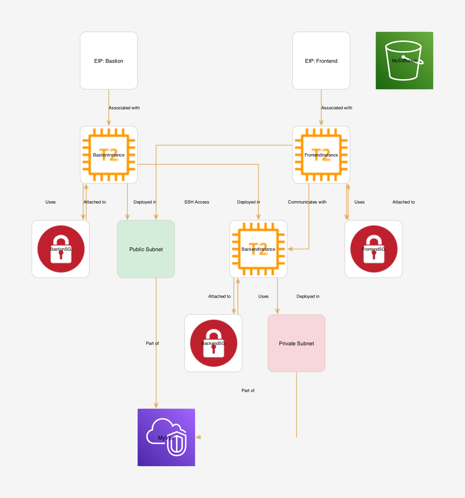

---

# **AWS Infrastructure Provisioning with Boto3 and Python**

## 🚀 Project Overview
This repository demonstrates how to provision robust AWS infrastructure using **Boto3** (AWS SDK for Python) and **Python**. The infrastructure includes:

## Project Structure
```
.
├── LICENSE                       # Legal terms for code usage and distribution
├── README.md                     # Project documentation and overview
├── architecture-diagram.png      # Visual representation of AWS infrastructure
├── config                        # Configuration management
│   └── constants.py              # Centralized configuration constants
├── main.py                       # Primary script for resource provisioning
├── requirements.txt              # Project dependency specifications
├── services                      # AWS resource management modules
│   ├── ec2_service.py            # EC2 instance and network configuration
│   ├── s3_service.py             # S3 bucket management and policies
│   └── vpc_service.py            # Network infrastructure setup
└── utils                         # Utility scripts
└── output.py                 # Resource creation result reporting
```
## Features

- 📦 **Infrastructure as Code (IaC)** using Boto3  
- 📡 **Networking**: VPC and Subnets  
- 📦 **Storage**: S3 Bucket with versioning
- 📟 **Compute**: EC2 Instances with Bastion Host, Frontend, and Backend  
- 🛡️ **Security**: Security Groups for EC2 instances  
- 🌐 **Virtual Private Cloud (VPC)** with public and private subnets  
- 🖥️ **EC2 Instances**: Bastion Host, Frontend, and Backend  
- 💾 **S3 Bucket** with versioning enabled  
- 🛡️ **Advanced Security Configurations**: Security Groups for secure access  
- 🌟 **Elastic IPs (EIPs)** for static public IP assignments  

---

## 📋 Prerequisites

Before getting started, ensure you have the following installed:

### Software Requirements
- [Python](https://www.python.org/downloads/) (3.8+)  
- [AWS CLI](https://aws.amazon.com/cli/)  
- [Boto3](https://boto3.amazonaws.com/)  
- AWS credentials configured with access to create resources in AWS.

---

## 🔐 AWS Account Preparation

### 1. Create an AWS Account  
Sign up for an AWS account to use the AWS Free Tier for your deployments and experiments.

### 2. Create an IAM User  
To deploy resources using the AWS CLI and Boto3, you need an IAM user with programmatic access:  

1. Log in to the AWS Management Console.  
2. Navigate to **IAM** (Identity and Access Management) and click **Users**.  
3. Click **Add users**, and provide a username.  
4. Select **Programmatic access** for the access type.  
5. Attach the **AdministratorAccess** policy to give full permissions.  
6. Download the **Access Key ID** and **Secret Access Key** upon creation.

### 3. Configure AWS CLI  
Set up AWS CLI to communicate with your AWS account:

```bash
aws configure
```

When prompted, enter:  
- **AWS Access Key ID** and **Secret Access Key** (from IAM creation).  
- **Default region name**: e.g., `us-east-1`.  
- **Default output format**: `json`.  

### 4. Environment Variables  
This project uses environment variables for dynamic configuration.  
Set the following variables in your environment:

- **`MY_IP`**: Your local machine's public IP for secure SSH access to the Bastion Host.  
- **`MY_SSH_KEY_NAME`**: The name of your EC2 key pair for instance access.  

Example:  
```bash
export MY_IP="YOUR_PUBLIC_IP"
export MY_SSH_KEY_NAME="my-key-pair"
```

---

## 🏗️ Architecture Diagram

  
*Comprehensive AWS Boto3 Infrastructure Layout.*

---

## 🛠️ Project Setup

### 1. Clone the Repository  
```bash
git clone https://github.com/zaidanali028/aws-boto3-infrastructure-lab.git
cd aws-boto3-infrastructure
```

### 2. Create a Virtual Environment  
```bash
# Create virtual environment
python3 -m venv .venv

# Activate the environment
# On macOS/Linux:
source .venv/bin/activate
# On Windows:
.venv\Scripts\activate
```

### 3. Install Project Dependencies  
```bash
pip install -r requirements.txt
```

---

## 🚢 Running the Infrastructure

### Create the Resources  
Run `main.py` to create all the necessary infrastructure (VPC, Subnets, EC2 instances, Security Groups, EIPs, S3 Bucket):

```bash
python main.py
```

### Outputs  
The output of created resources (instance IDs, EIP addresses, S3 Bucket name) will be displayed in the terminal.

---

## 🌟 Core Features

### **VPC Setup**
- Configures a VPC with public and private subnets.  
- Public subnets are configured to automatically assign public IPs.  

### **EC2 Instances**
1. **Bastion Host**  
   - Deployed in a public subnet.  
   - Configured for SSH access from `MY_IP`.  

2. **Frontend Instance**  
   - Public-facing instance for hosting applications.  
   - Elastic IP for consistent address allocation.  

3. **Backend Instance**  
   - Private instance for internal operations.  
   - Accessible only via Bastion Host or Frontend.  

### **S3 Bucket**
- Versioning enabled for object recovery and tracking.  
- Configured for automatic deletion during stack cleanup.  

### **Elastic IPs (EIPs)**
- Automatically associates Elastic IPs to public instances to ensure static and consistent IP addresses.

### **Security Groups**
- Custom security groups for each instance type (Bastion, Frontend, Backend).  
- Granular access control via ingress/egress rules.

---

## 🛡️ Security Considerations

- **Granular Security Groups**:  
  - Restrict SSH access to Bastion Host from `MY_IP`.  
  - Allow only necessary HTTP/HTTPS traffic to Frontend instances.  
- **IAM Roles**: Use roles over static credentials for enhanced security.  
- **Elastic IPs**: Ensure static and controlled access to public-facing instances.  
- **Versioned S3 Buckets**: Secure object lifecycle management.

---

## 🔍 Troubleshooting

- **AWS CLI issues**: Verify `aws configure` and environment variables.  
- **Deployment failures**: Check logs and review resource configurations.  
- **Network errors**: Check security group rules and VPC configurations.

---

## 📜 License  

- This project is licensed under the MIT License - see the [MIT](LICENSE) file for details.

---

## Acknowledgments

- **Boto3** for enabling easy infrastructure provisioning through Python.
- **The open-source community** for continuously creating and maintaining tools that make projects like this one possible.

---

## Support

For support, please open an issue in the repository or contact the maintainer at zaidanali028@gmail.com.

---

**Happy Cloud Engineering! 🌩️☁️ 🚀!**

--- 

